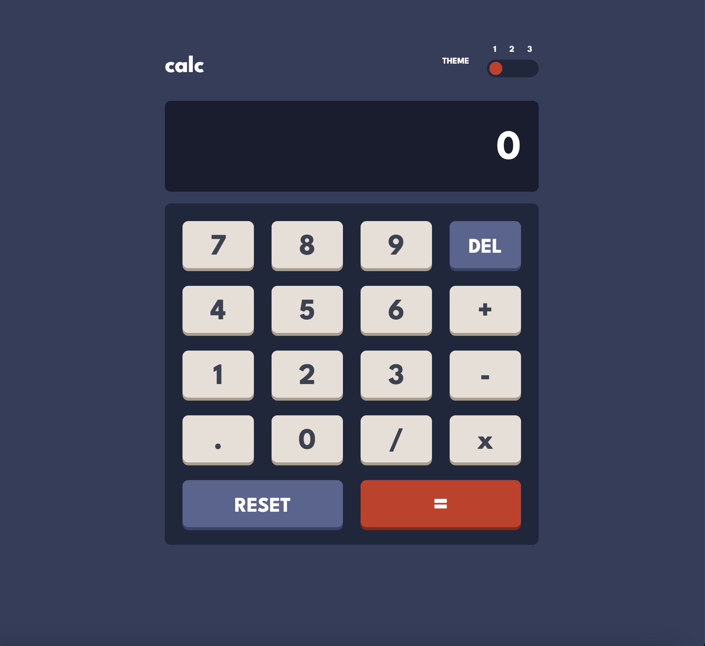

# Frontend Mentor - Calculator app solution

### Description

This is a solution to the [Calculator app challenge on Frontend Mentor](https://www.frontendmentor.io/challenges/calculator-app-9lteq5N29).

### Features

- Three color themes.
- Basic calculator functions (addition, subtraction, multiplication, division).
- Ability to chain operations.
- Reset and delete buttons.

### Built With

- Semantic HTML5.
- CSS.
- Vanilla Javascript.
- BEM.

### Links

- GitHub URL: [https://github.com/norrland90/calculator-frontendmentor]
- Live Site URL: [https://norrland90.github.io/calculator-frontendmentor]

### Contact

Created by [@norrland90](https://github.com/norrland90) - feel free to contact me!
